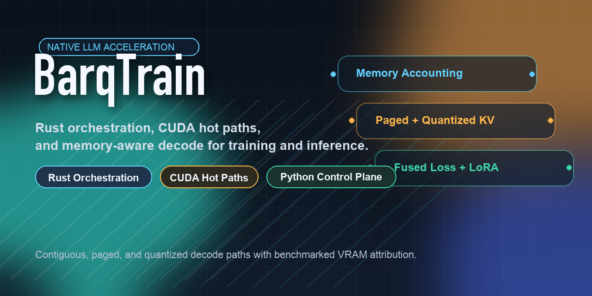

# BarqTrain



BarqTrain is a native acceleration layer for decoder-only LLM training and inference. It keeps Python as the user-facing control plane while moving hot-path work into Rust and CUDA/C++.

The project currently ships the ten planned implementation phases tracked in this repository:

- native memory accounting and decode cleanup
- paged KV cache
- quantized KV cache
- fused LM-head projection and loss
- Rust packing plus padding-free training metadata
- activation checkpointing presets
- native optimizer-state modes
- deeper RMSNorm block fusion
- native attention dispatch for decode-heavy workloads
- fused LoRA training-path improvements

Implementation history and remaining follow-on work are tracked in [IMPLEMENTATION_PLAN.md](IMPLEMENTATION_PLAN.md).

## What ships today

| Area | Shipped capability |
|------|--------------------|
| Memory accounting | Separate resident model, KV-cache, decode scratch, training peak, and inference peak reporting |
| Decode path | Last-token logits specialization when full logits are not required |
| KV cache | Contiguous, paged, and paged-quantized cache modes |
| Training loss | Fused LM-head projection plus chunked cross-entropy |
| Data path | Rust sequence packing and padding-free packed metadata |
| Adapter training | Fused LoRA path with PEFT-style module replacement |
| Attention | FlashAttention integration, SDPA fallback, and native decode dispatch |
| Activations | `max_throughput`, `balanced`, and `max_memory_saving` checkpoint presets |
| Optimizer state | Native AdamW modes with explicit state accounting |
| RMSNorm | Fused RMSNorm plus residual-add and projection-side block fusion helpers |

## Install

### Local

```bash
git clone https://github.com/YASSERRMD/BarqTrain.git
cd BarqTrain

curl https://sh.rustup.rs -sSf | sh -s -- -y
export PATH="$HOME/.cargo/bin:$PATH"

python -m pip install --upgrade pip setuptools wheel setuptools-rust
python -m pip install -e . --no-build-isolation

# Optional CUDA extension build
BARQTRAIN_BUILD_CUDA=1 python -m pip install -e . --no-build-isolation
```

### Colab

Use the maintained notebooks in `examples/` for the full Colab flow, including native build, runtime restart, verification, training, and benchmark steps:

- Training and inference notebook:
  [GitHub](https://github.com/YASSERRMD/BarqTrain/blob/main/examples/barqtrain_training_inference_colab.ipynb)
  [Colab](https://colab.research.google.com/github/YASSERRMD/BarqTrain/blob/main/examples/barqtrain_training_inference_colab.ipynb)
- Benchmark comparison notebook:
  [GitHub](https://github.com/YASSERRMD/BarqTrain/blob/main/examples/barqtrain_benchmark_comparison_colab.ipynb)
  [Colab](https://colab.research.google.com/github/YASSERRMD/BarqTrain/blob/main/examples/barqtrain_benchmark_comparison_colab.ipynb)

## Core API

### Training path

```python
from datasets import load_dataset
from torch.utils.data import DataLoader
from transformers import AutoModelForCausalLM, AutoTokenizer

from barqtrain import (
    PackedCausalLMDataCollator,
    create_optimizer,
    patch_lora_modules,
    patch_model,
)

model_id = "Qwen/Qwen2-0.5B-Instruct"
tokenizer = AutoTokenizer.from_pretrained(model_id)
if tokenizer.pad_token is None:
    tokenizer.pad_token = tokenizer.eos_token

model = AutoModelForCausalLM.from_pretrained(model_id)
patch_model(model)
patch_lora_modules(
    model,
    target_modules=("q_proj", "k_proj", "v_proj", "o_proj"),
    rank=8,
    alpha=16.0,
)

dataset = load_dataset("wikitext", "wikitext-2-raw-v1", split="train[:256]")

def tokenize(batch):
    return tokenizer(batch["text"], truncation=True, max_length=512, padding=False)

tokenized = dataset.map(tokenize, batched=True, remove_columns=dataset.column_names)
collator = PackedCausalLMDataCollator(
    max_length=512,
    pad_token_id=tokenizer.pad_token_id,
    eos_token_id=tokenizer.eos_token_id,
)
dataloader = DataLoader(tokenized, batch_size=4, shuffle=True, collate_fn=collator)

optimizer = create_optimizer(model.parameters(), lr=1e-5, optimizer_name="barqtrain_adamw")
```

### Inference path

```python
import os
import torch
from transformers import AutoModelForCausalLM, AutoTokenizer

from barqtrain import create_kv_cache, patch_inference

os.environ["BARQTRAIN_KV_CACHE_MODE"] = "paged_quantized"
os.environ["BARQTRAIN_LAST_TOKEN_LOGITS_ONLY"] = "1"

model_id = "Qwen/Qwen2-0.5B-Instruct"
tokenizer = AutoTokenizer.from_pretrained(model_id)
model = AutoModelForCausalLM.from_pretrained(model_id, torch_dtype=torch.float16).cuda()
patch_inference(model)

inputs = tokenizer("Explain paged KV caches.", return_tensors="pt").to("cuda")
cache = create_kv_cache(model, max_batch_size=1, max_cache_len=256, page_size=16, mode="paged_quantized")
outputs = model.generate(**inputs, max_new_tokens=64, past_key_values=cache)
```

## Benchmark suites

BarqTrain exposes benchmark suites through `python -m barqtrain.benchmarks.baseline --suite <phase>`.

| Suite | Focus | Output |
|------|-------|--------|
| `phase1` | memory accounting and decode cleanup | `phase1_results.json` |
| `phase2` | contiguous vs paged KV cache | `phase2_results.json` |
| `phase3` | paged quantized KV cache | `phase3_results.json` |
| `phase4` | fused projection and loss path | `phase4_results.json` |
| `phase5` | padded vs packed training | `phase5_results.json` |
| `phase6` | activation checkpointing presets | `phase6_results.json` |
| `phase7` | optimizer-state tradeoffs | `phase7_results.json` |
| `phase8` | RMSNorm block fusion | `phase8_results.json` |
| `phase9` | attention dispatch | `phase9_results.json` |
| `phase10` | fused LoRA training path | `phase10_results.json` |

Detailed native profiling remains opt-in through `BARQTRAIN_DETAILED_PROFILING=1`.

The standard memory report shape uses:

- `resident_model_mb`
- `kv_cache_mb`
- `temporary_decode_buffers_mb`
- `training_peak_vram_mb`
- `inference_peak_vram_mb`

Example benchmark command:

```bash
python -m barqtrain.benchmarks.baseline \
  --suite phase10 \
  --model tinyllama \
  --sequence_length 512 \
  --inference-batch-sizes 1,4,8
```

## Important runtime knobs

| Variable | Purpose |
|----------|---------|
| `BARQTRAIN_KV_CACHE_MODE` | `auto`, `contiguous`, `paged`, or `paged_quantized` |
| `BARQTRAIN_QUANTIZED_KV_RESIDUAL_TOKENS` | Full-precision residual window for quantized KV mode |
| `BARQTRAIN_LAST_TOKEN_LOGITS_ONLY` | Enable or disable decode-time last-token projection |
| `BARQTRAIN_DETAILED_PROFILING` | Enable detailed native memory tracking |
| `BARQTRAIN_BUILD_CUDA` | Build the CUDA extension during installation |

## Supported model families

BarqTrain includes shipped patch coverage for:

- Llama family
- Qwen family
- Mistral and Mixtral
- DeepSeek family
- Phi family
- Gemma family
- OLMo family
- Granite
- Jamba
- Liquid LFM2

Support level varies by model family and feature. RMSNorm patching coverage is broader than deeper block-fusion or inference-specialization coverage.

## Repository layout

```text
barqtrain/
|- python/barqtrain/
|- csrc/
|- rust/
|- tests/
`- examples/
```

## Development

Run targeted tests:

```bash
pytest tests/test_rmsnorm.py -v
pytest tests/test_lora.py -v
pytest tests/test_benchmarks.py -v
```

Run Rust checks:

```bash
cargo check --manifest-path rust/Cargo.toml
```

## License

MIT. See `LICENSE`.
